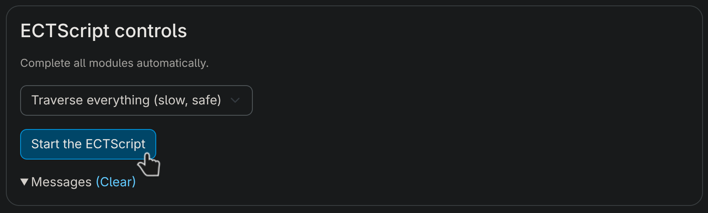

# ECTScript

Although the course Diversity Skills ([EN](https://tiss.tuwien.ac.at/course/courseDetails.xhtml?courseNr=064030) / [DE](https://tiss.tuwien.ac.at/course/courseDetails.xhtml?courseNr=064029)) by TU Wien aims to convey the importance of inclusion, it does not seem to be very accessible for students with limited time.

This tool can solve this problem by providing the student with a more streamlined approach for completing the course.

## Note

Do not use this tool. The code in this repo is just for educational purposes and was never actually tested.

## Usage

- Install [Tampermonkey](https://chromewebstore.google.com/detail/tampermonkey/dhdgffkkebhmkfjojejmpbldmpobfkfo?hl=en) on a Chromium-based browser or [Greasemonkey](https://addons.mozilla.org/de/firefox/addon/greasemonkey/) on Firefox
- Install the script [from here](https://greasyfork.org/en/scripts/562464) or copy the code into the extension manually
- Visit the Diversity Skills course page on TUWEL
- Click "Start the ECTScript"
  

You can receive seperate credits for both the English and German course.
